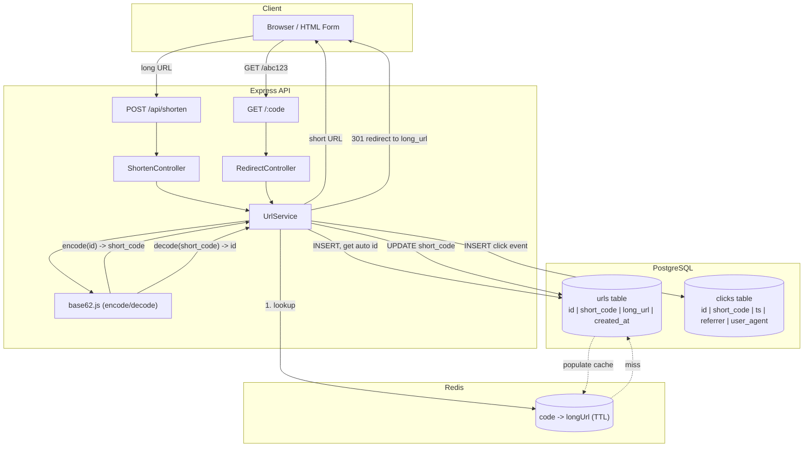

# Architecture

## 1. Overview

`url-shortly` is a URL shortening service. It accepts a long URL and returns a
short, unique code generated by encoding an auto-incrementing numeric ID into
**Base62** (`[0-9a-zA-Z]`). The short code is later used to look up and
redirect to the original URL.

The system is intentionally simple and self-contained: a single Express API,
a static HTML/CSS/JS frontend served alongside it, Postgres as the durable
store, and Redis as a read-through cache in front of the hot redirect path.

## 2. Goals & Non-Goals

**Goals**
- Deterministic, collision-free short codes via ID encoding (not random
  hashing + collision retry).
- Fast redirects (`GET /:code`) — the highest-traffic, latency-sensitive path.
- Clear separation of concerns (routes / controllers / services / lib) so the
  business logic (Base62 encoding, URL validation) stays framework-agnostic
  and unit-testable in isolation.
- Track click/redirect events (timestamp, referrer, user-agent) per short
  code for basic analytics.

**Non-Goals** (for this version)
- User accounts / auth.
- Custom aliases or vanity codes.
- Link expiry.

These are natural extensions but are out of scope until explicitly added to
`build-plan.md`.

## 3. Tech Stack

| Layer          | Choice                              |
|----------------|--------------------------------------|
| Runtime        | Node.js v20.12 LTS, CommonJS         |
| Framework      | Express.js v4.19.2                   |
| Frontend       | Static HTML + vanilla CSS/JS (no framework, no build step) |
| Primary store  | PostgreSQL — source of truth for URL mappings |
| Cache          | Redis — caches `code -> longUrl` lookups for the redirect path |
| Testing        | Jest + Supertest                     |
| Container      | Docker (manual deploy, no CI/CD yet) |

## 4. Core Flow: Shortening a URL

1. Client submits a long URL via `POST /api/shorten`.
2. Controller validates the input URL (well-formed, allowed protocol).
3. Service layer inserts a new row into Postgres (`urls` table), letting the
   database assign the auto-incrementing primary key (`id`).
4. The returned `id` is encoded into a Base62 string (the short code) via a
   pure function in `src/lib/base62.js`.
5. The short code is written back to the same row.
6. Response returns the short URL to the client.

## 5. Core Flow: Redirecting

1. Client requests `GET /:code`.
2. Controller decodes the Base62 code back into a numeric ID (cheap, in
   memory — no DB hit needed just to decode).
3. Service checks Redis for `code -> longUrl`.
   - **Cache hit**: return the long URL immediately, issue a 301 redirect.
   - **Cache miss**: query Postgres by ID, populate Redis (with a TTL), then
     redirect with 301.
4. If no record exists for the given ID, return 404.
5. Record a click event (short code, timestamp, referrer, user-agent) into
   Postgres. This happens on every resolved request regardless of cache
   hit/miss — see D7 for why click recording is decoupled from caching.

## 6. Diagram

## 7. Design Decisions

**D1 — Base62 over random string generation.**
Encoding an auto-incrementing ID is deterministic and collision-free by
construction, unlike generating a random string and retrying on collision.
It also keeps early codes short, since code length only grows as the ID
space grows.

**D2 — Postgres is the source of truth; Redis is a cache, not primary storage.**
Redis entries can be evicted or lost without data loss — they're always
reconstructible from Postgres. This keeps the durability story simple: one
system to back up, one system to reason about consistency for.

**D3 — Decode short codes in-process, not via DB lookup.**
Because the short code is a direct encoding of the numeric ID, decoding it
back to an ID is a pure computation (no I/O). Only the ID -> long URL
resolution needs a data store hit, and that's exactly where the cache sits.

**D4 — Strict layering (routes / controllers / services / lib).**
`src/services/` never imports Express or touches `req`/`res`. This keeps the
Base62 logic and URL-mapping logic unit-testable with plain Jest tests, with
Supertest reserved for HTTP-layer integration tests.

**D5 — Static HTML frontend, no framework.**
The frontend's only job is to submit a form and display the result. A build
step (React/Vue/etc.) would add tooling overhead disproportionate to the
UI's complexity.

**D6 — 301 (permanent) redirect, chosen over 302 despite the analytics tradeoff.**
Browsers and intermediate caches/CDNs are allowed to cache a 301 response, so
a repeat visitor's second click on the same short link may be served from
cache and never reach the server at all — undercounting click analytics
compared to a 302 (temporary redirect, no caching), which is what most
production shorteners use for exactly this reason. This project explicitly
accepts that tradeoff: 301 was chosen for its link semantics (a short URL is
a permanent alias for the long URL). If click accuracy becomes a priority
later, revisit this — switching to 302 is a one-line change in
`redirectController.js`.

**D7 — Click events are recorded in Postgres, decoupled from the cache path.**
Click recording happens after cache lookup resolves (hit or miss) so it
doesn't affect cache logic or the D2 cache/source-of-truth split — the
`clicks` table is an independent, append-only log keyed by `short_code`,
written on every successfully resolved redirect. Recording is a synchronous
Postgres insert on the hot redirect path for the initial version; if this
proves too slow under load, consider writing to Redis (`INCR`/`LPUSH`) and
flushing to Postgres asynchronously — tracked as a follow-up, not part of
the initial implementation.

## 8. Error Handling

Per project convention (see `context/rules.md`):
- Every async controller wraps its body in `try/catch` and forwards errors
  via `next(err)`.
- A single centralized error-handling middleware, mounted last in
  `server.js`, is the only place that writes error responses.
- Services throw plain `Error` (or typed error subclasses) — they never
  format HTTP responses.

## 9. Open Questions

- Exact Postgres schema / migration tool (raw SQL vs. Prisma/Knex) — TBD in
  `build-plan.md`.
- Redis TTL value for cached redirects — TBD based on expected traffic
  patterns.
- Whether click recording stays a synchronous Postgres insert or moves to an
  async Redis-buffered write — revisit if it becomes a bottleneck (see D7).
